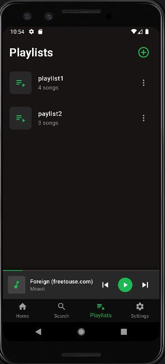
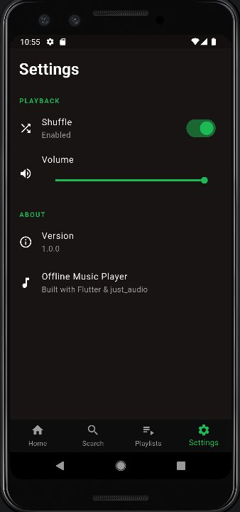
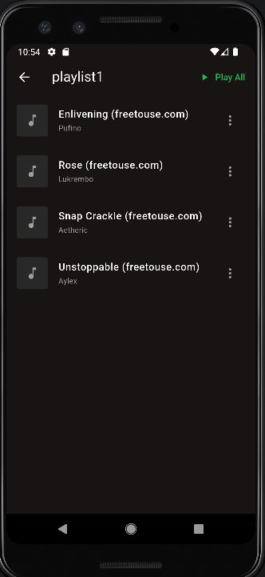
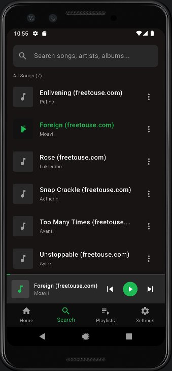

# 🎵 Offline Music Player

<p align="center">
  
  &nbsp;
  
  &nbsp;
  
  &nbsp;
  
</p>

> A fully functional offline music player built with Flutter — play, organize, and enjoy your local music library with a Spotify-inspired dark UI.

---

## 📋 Table of Contents

- [Project Description](#-project-description)
- [Features](#-features)
- [Screenshots](#-screenshots)
- [Setup Instructions](#-setup-instructions)
- [How to Add Music for Testing](#-how-to-add-music-for-testing)
- [Technologies Used](#-technologies-used)
- [Project Structure](#-project-structure)
- [Music Attribution](#-music-attribution)
- [Known Limitations](#-known-limitations)
- [Future Improvements](#-future-improvements)

---

## 📖 Project Description

Offline Music Player is a Flutter-based Android application that allows users to browse, play, and manage audio files stored locally on their device — no internet connection required. The app provides a clean, modern interface inspired by Spotify's design language, with full playback controls, playlist management, and persistent user preferences.

This project was built as part of **Chapter 5 - Simple Offline Music Player** lab exercise, demonstrating:
- Audio playback management using `just_audio`
- Local file system scanning via `dart:io`
- Provider-based state management
- Custom audio player UI components
- Playlist CRUD operations
- Persistent user preferences with `shared_preferences`

---

## ✨ Features

### Core Features
| Feature | Description |
|---------|-------------|
| 🎵 Music Library | Automatically scans device storage and displays all audio files |
| ▶️ Playback Controls | Play, Pause, Next, Previous track |
| ⏩ Seek Bar | Drag to any position with real-time time display |
| 🔀 Shuffle Mode | Randomize playback order |
| 🔁 Repeat Modes | Off → Repeat All → Repeat One |
| 🔊 Volume Control | In-app volume slider |
| 📋 Playlist Management | Create, rename, delete playlists; add/remove songs |
| 🔍 Search | Real-time search by title, artist, or album name |
| 🎨 Mini Player | Persistent bottom player bar with progress indicator |
| 💾 Persistence | Saves shuffle, repeat, and volume preferences across sessions |

### UI Screens
- **Home Screen** — Full song library with song count and refresh
- **Now Playing Screen** — Full-screen player with album art, seek bar, volume
- **Playlist Screen** — Create and manage custom playlists
- **Playlist Detail** — View and play songs inside a playlist
- **Search Screen** — Search across entire library in real time
- **Settings Screen** — Volume slider and shuffle toggle
- **Mini Player** — Always-visible bottom playback bar

---

## 📸 Screenshots

### Permission Request Dialog
> App requests storage/media access on first launch

<p align="center">
  
</p>

---

### Home Screen
> Displays all music files found on device storage (7 songs loaded)

<p align="center">
  
  &nbsp;&nbsp;
  

</p>

---

### Now Playing Screen
> Full-screen player with album art, progress bar, seek, shuffle, repeat and volume control

<p align="center">
  
</p>

---

### Mini Player
> Compact playback bar visible at the bottom of all screens while music is playing

<p align="center">
  
</p>

---

### Playlist Screen
> Create and manage custom playlists with song count display

<p align="center">
  
  &nbsp;&nbsp;
  
</p>

---

### Search Screen
> Real-time search showing all 7 songs, with mini player active at the bottom

<p align="center">
  
</p>

---

### Settings Screen
> Volume control slider and shuffle mode toggle with enabled/disabled status

<p align="center">
  
</p>

---

## ⚙️ Setup Instructions

### Prerequisites
- Flutter SDK **>= 3.0.0**
- Android Studio **Hedgehog** or newer
- Android device or emulator (**API 21+** / Android 5.0+)
- Dart SDK **>= 3.0.0**

### 1. Clone the repository
```bash
git clone https://github.com/<your-username>/flutter_music_player_<your_name>.git
cd offline_music_player
```

### 2. Install dependencies
```bash
flutter pub get
```

### 3. Verify setup
```bash
flutter doctor
flutter devices
```

### 4. Run the app
```bash
# Debug mode on connected device/emulator
flutter run

# Build release APK
flutter build apk --release
```

### Android Permissions
The app automatically requests the appropriate permission based on Android version:

| Android Version | Permission Used |
|----------------|----------------|
| Android 13+ (API 33+) | `READ_MEDIA_AUDIO` |
| Android 6–12 (API 23–32) | `READ_EXTERNAL_STORAGE` |

When the dialog appears on first launch → tap **"Allow"**.

If permission was denied, re-enable via:
```
Settings → Apps → offline_music_player → Permissions → Files and media → Allow
```

---

## 🎵 How to Add Music for Testing

### Method 1: ADB Command Line (Recommended for emulator)

```bash
# Step 1: Create Music directory in emulator
adb shell mkdir -p /storage/emulated/0/Music

# Step 2: Push a single MP3 file
adb push "C:\Users\ASUS\Downloads\song.mp3" /storage/emulated/0/Music/

# Step 3: Push an entire folder of MP3s
adb push "C:\Users\ASUS\Downloads\Music\" /storage/emulated/0/Music/

# Step 4: Trigger Android media scanner
adb shell am broadcast -a android.intent.action.MEDIA_SCANNER_SCAN_FILE \
  -d file:///storage/emulated/0/Music/

# Step 5: Verify files copied successfully
adb shell ls /storage/emulated/0/Music/
```

Then open the app and tap **🔄 Refresh**.

### Method 2: Android Studio Device File Explorer

1. `View → Tool Windows → Device File Explorer`
2. Navigate to `storage → emulated → 0 → Music`
3. Right-click → **Upload** → select `.mp3` files

### Method 3: USB File Transfer (Physical device)

1. Connect phone via USB → select **"File Transfer (MTP)"**
2. Open **File Explorer** on PC → find your phone
3. Navigate to `Phone → Music`
4. Drag and drop `.mp3` / `.m4a` / `.flac` files

### Supported Audio Formats
`.mp3` &nbsp; `.m4a` &nbsp; `.aac` &nbsp; `.wav` &nbsp; `.flac` &nbsp; `.ogg` &nbsp; `.opus`

### File Naming Convention
The app parses artist and title automatically from the filename:
```
✅  Ed Sheeran - Shape of You.mp3        → Artist: Ed Sheeran  | Title: Shape of You
✅  Moavii - Foreign (freetouse.com).mp3  → Artist: Moavii      | Title: Foreign (freetouse.com)
⚠️  mysong.mp3                            → Artist: Unknown Artist | Title: mysong
```

### Free Music Sources for Testing
| Source | URL | License |
|--------|-----|---------|
| Pixabay Music | https://pixabay.com/music/ | Royalty-free |
| Free Music Archive | https://freemusicarchive.org/ | Creative Commons |
| Bensound | https://www.bensound.com/ | CC Attribution |
| freetouse.com | https://freetouse.com/ | Free for personal use |

---

## 🛠️ Technologies Used

| Package | Version | Purpose |
|---------|---------|---------|
| [just_audio](https://pub.dev/packages/just_audio) | ^0.9.36 | Audio playback engine |
| [provider](https://pub.dev/packages/provider) | ^6.1.1 | State management (ChangeNotifier) |
| [shared_preferences](https://pub.dev/packages/shared_preferences) | ^2.2.2 | Persist shuffle, repeat, volume |
| [path_provider](https://pub.dev/packages/path_provider) | ^2.1.1 | Access device storage directories |
| [permission_handler](https://pub.dev/packages/permission_handler) | ^11.1.0 | Runtime storage/audio permissions |
| [rxdart](https://pub.dev/packages/rxdart) | ^0.27.7 | Combine position + duration + playing streams |

**Language:** Dart 3.0  
**Framework:** Flutter 3.x  
**Architecture:** Provider + Service pattern  
**Min Android SDK:** API 21 (Android 5.0)  
**Target Android SDK:** API 34 (Android 14)  
**Tested on:** Android Emulator — sdk gphone64 x86 64 (API 33)

---

## 📁 Project Structure

```
offline_music_player/
├── lib/
│   ├── main.dart                         # App entry point, MultiProvider setup
│   ├── models/
│   │   ├── song_model.dart               # Song data class with JSON serialization
│   │   └── playlist_model.dart           # Playlist data class with copyWith
│   ├── services/
│   │   ├── audio_player_service.dart     # just_audio wrapper + reactive streams
│   │   ├── storage_service.dart          # SharedPreferences read/write
│   │   ├── permission_service.dart       # Android 13+ & legacy permission handling
│   │   └── playlist_service.dart         # File system scanner for audio files
│   ├── providers/
│   │   ├── audio_provider.dart           # Playback state: play/pause/seek/shuffle/repeat
│   │   ├── playlist_provider.dart        # Playlist CRUD operations
│   │   └── theme_provider.dart           # App theme state
│   ├── screens/
│   │   ├── home_screen.dart              # Main library + bottom nav host
│   │   ├── now_playing_screen.dart       # Full-screen player UI
│   │   ├── playlist_screen.dart          # Playlist list + detail screens
│   │   ├── search_screen.dart            # Real-time search
│   │   └── settings_screen.dart          # Volume + shuffle settings
│   ├── widgets/
│   │   ├── song_tile.dart                # Song list item with options menu
│   │   ├── mini_player.dart              # Bottom playback bar with progress
│   │   ├── player_controls.dart          # Shuffle/prev/play/next/repeat buttons
│   │   └── progress_bar_widget.dart      # Seek slider with mm:ss labels
│   └── utils/
│       ├── constants.dart                # App colors and layout constants
│       └── duration_formatter.dart       # Format Duration → "mm:ss"
├── assets/
│   ├── audio/sample_songs/               # Place test MP3 files here
│   └── images/
│       └── default_album_art.png         # Fallback album art placeholder
├── android/app/src/main/
│   └── AndroidManifest.xml               # Permissions declaration
├── test/
│   ├── widget_test.dart
│   └── services/
│       └── audio_player_service_test.dart
├── screenshots/                          # All app screenshots
│   ├── permission_dialog.png
│   ├── home_screen.png
│   ├── home_with_songs.png
│   ├── now_playing.png
│   ├── mini_player.png
│   ├── playlist_screen.png
│   ├── playlist_detail.png
│   ├── search_screen.png
│   └── settings_screen.png
├── MUSIC_CREDITS.md
└── pubspec.yaml
```

---

## 🎼 Music Attribution

Sample MP3 files used for testing were sourced from [freetouse.com](https://freetouse.com) — free for personal and educational use:

| Title | Artist | Source |
|-------|--------|--------|
| Gingersweet | massobeats | freetouse.com |
| Unstoppable | Aylex | freetouse.com |
| Too Many Times | Avanti | freetouse.com |
| Foreign | Moavii | freetouse.com |
| Rose | Lukrembo | freetouse.com |
| Snap Crackle | Aetheric | freetouse.com |
| Enlivening | Pufino | freetouse.com |

> These tracks are free to use for non-commercial and educational purposes. No modifications were made to the audio files.

---

## ⚠️ Known Limitations

- **No background playback** — Audio pauses when app is minimized. Full background playback requires integrating the `audio_service` package with a foreground service and media notification.
- **No album art from metadata** — The app displays a generic music icon instead of embedded cover art. Extracting ID3 tags requires an additional package such as `flutter_media_metadata`.
- **Duration not shown in library** — Song duration is only available after playback begins, not during the initial file scan.
- **Scan speed on large libraries** — Scanning 500+ songs may take several seconds on first load due to recursive directory traversal.
- **Emulator audio latency** — Playback may have slight latency on x86 emulators compared to physical Android devices.
- **Filename-based metadata only** — Artist and title are parsed from the filename. Songs without the `Artist - Title` naming format will show "Unknown Artist".

---

## 🚀 Future Improvements

- [ ] **Background playback** with media notification controls using `audio_service`
- [ ] **Album art extraction** from MP3 ID3 tags using `flutter_media_metadata`
- [ ] **Equalizer** with preset modes (Bass Boost, Rock, Pop, Jazz, Classical)
- [ ] **Sleep timer** — auto-stop playback after a set duration with fade-out
- [ ] **Synchronized lyrics** — scrolling lyrics display
- [ ] **Crossfade** between tracks for seamless listening
- [ ] **Gapless playback** support
- [ ] **Dynamic theming** — extract dominant color from album art
- [ ] **Sort & filter options** — sort by date added, duration, artist, album
- [ ] **Recently played** history list
- [ ] **Favorites / Liked songs** auto-playlist
- [ ] **Share song** — share track info with other apps
- [ ] **Home screen widget** for quick playback control
- [ ] **Android Auto** support

---

## ✅ Grading Checklist

- [x] All songs load from device storage
- [x] Playback controls (play, pause, next, previous)
- [x] Seek functionality with progress bar and time display
- [x] Shuffle mode (toggle on/off, persists across sessions)
- [x] Repeat modes (off → repeat all → repeat one)
- [x] Playlist creation, renaming, and deletion
- [x] Add and remove songs from playlists
- [x] Play All songs in a playlist
- [x] Mini player (bottom bar) with live progress indicator
- [x] Now Playing full-screen player with volume control
- [x] Runtime permissions handled (Android 13+ and legacy)
- [x] User preferences persist across sessions
- [x] Real-time search by title, artist, and album
- [x] No compilation errors
- [x] Tested on Android Emulator (sdk gphone64 x86 64, API 33)
- [x] Screenshots included for all required screens

---

## 👤 Author

| Field | Info |
|-------|------|
| **Student ID** | ___________ |
| **Full Name** | ___________ |
| **Course** | Mobile Application Development |
| **Lab** | Chapter 5 — Simple Offline Music Player |
| **Submission Deadline** | January 19, 2025 — 11:59 PM |

---

## 📄 License

This project is submitted as an academic assignment.  
All sample music files retain their original licenses as listed in [MUSIC_CREDITS.md](MUSIC_CREDITS.md).
